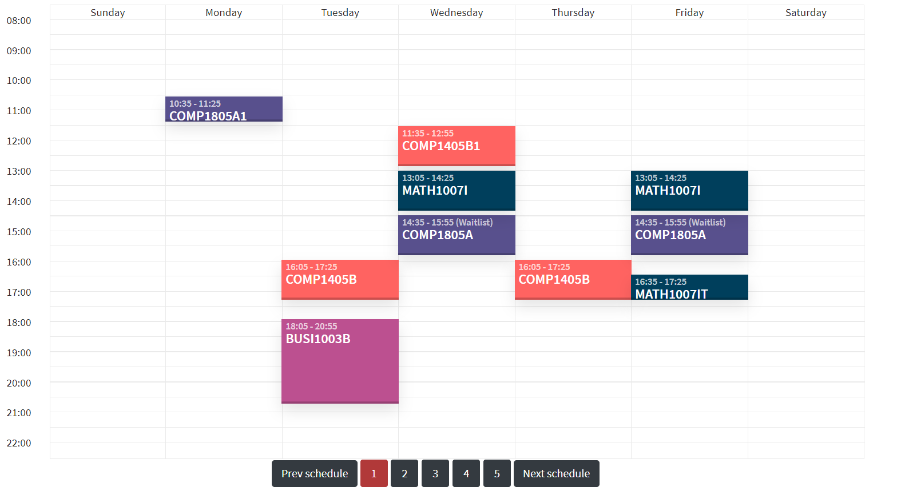
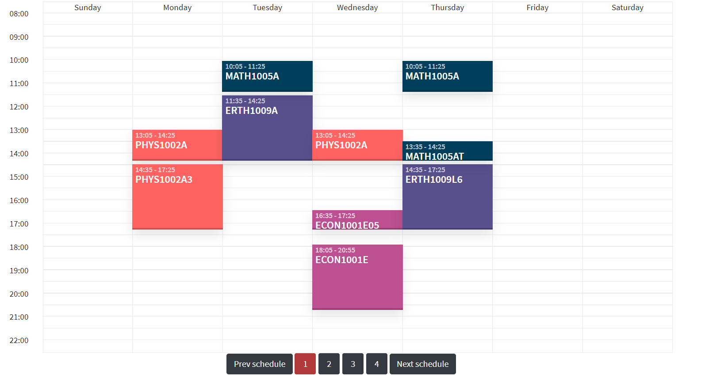

# cuScheduling

The Carleton Student Timetable Generator - Build your schedule at the click of a button!

  Get all your labs and tutorials           |  Prioritize days off
:-------------------------:|:-------------------------:
  | 

visit www.cuscheduling.net 

Documentation
* Ruby 2.3.3
* Rails 5.1.7
* Nokogiri 1.10.5
* Mechanize 2.7.6
* Capistrano 3.11

Developed and mainted by Tobias Schlagenhaufer

If you have any questions or would like to report a bug, email me at tobiasschlagenhaufer@cmail.carleton.ca
